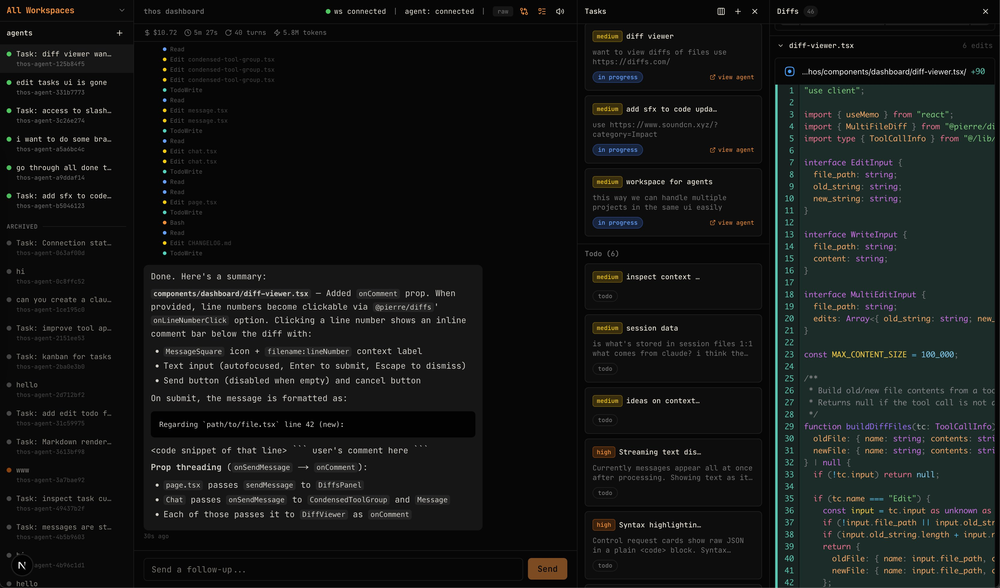

# thos



**the orchestrator you never knew you needed**

A visual orchestration layer for [Claude Code](https://docs.anthropic.com/en/docs/claude-code). Not another IDE — a UI that sits on top of the terminal-based agents you already use, solving the real friction of working with them day-to-day.

## The Problem

AI coding agents are powerful, but the experience of *using* them has real gaps:

- **You lose track of what's happening.** Multiple agents running across tasks, and you're tab-switching and scrolling terminals to figure out who's doing what. The visibility problem compounds fast.

- **Agents are smart but have the memory of an infant.** Your workflows are specific to you — your project structure, your preferences, your domain knowledge. The agent doesn't retain any of it between sessions. You end up re-explaining the same context over and over. A static CLAUDE.md helps, but it doesn't learn from your conversations or evolve with your codebase.

- **Your machine is the bottleneck.** You have a laptop, not a build server. Agents want to compile, test, run — and your local machine can't keep up.

- **Undoing things is painful.** Agent makes a wrong turn, and now you're doing forensics. Better change tracking, rollback, and context management should be table stakes — not an afterthought.

- **Task management is manual.** Coordinating what gets done, in what order, across which agents — that's on you, in your head, with no tooling to help.

## What thos Is

thos is a UI wrapper around Claude Code. Terminals are fine — but when you're orchestrating work across agents, you need something more visual.

Think of it as a control plane:

- **Agent dashboard** — see what every agent is doing, in real time, at a glance
- **Persistent memory** — agents that learn from your conversations and retain domain knowledge across sessions. Not just saved prompts — context that evolves with your codebase and workflows, so the first time you explain something is the last time.
- **Change management** — track, diff, and roll back agent-generated changes with confidence
- **Task orchestration** — assign, sequence, and track work across agents
- **Remote access** — web UI accessible via localhost, with the option to expose over your network as needed

## What thos Is Not

- **Not an IDE.** VS Code, Cursor, Zed — these are well-engineered. thos doesn't compete with them; it complements them.
- **Not a terminal replacement.** The terminal is the execution layer. thos is the visibility and coordination layer on top.
- **Not a general agent framework.** Focused on Claude Code first. Breadth comes later, if it makes sense.

## Prior Art

Similar space as [superset.sh](https://superset.sh) and [Conductor](https://conductor.sh) — tools that recognize the gap between raw agent capability and the UX of actually orchestrating agent work.

## Architecture

### WebSocket relay server (`server/ws.ts`)

A standalone WebSocket server on port 9900, started alongside Next.js via `concurrently`. Two connection families:

- **`/browser`** — React dashboard connects here. Supports multiple tabs simultaneously.
- **`/claude/:agentId`** — each Claude CLI connects here (passed as `--sdk-url`).

The server acts as a relay: browser spawns agents, the server launches `claude` inside tmux sessions, and all CLI NDJSON messages are forwarded to the browser as `{ type: "relay", agentId, message }`.

### Session persistence (`server/session-store.ts`)

Agent state and full message history are persisted to `$TMPDIR/thos-sessions/<agentId>.json`. This means:

- **Page refresh** restores all conversations — the server replays `message_history` to each connecting browser.
- **Server restart** restores agents from disk. On startup, the server checks which tmux sessions are still alive (`tmux list-sessions`) and marks agents accordingly — `disconnected` if the tmux session survived, `done` if it didn't.
- **Multiple browser tabs** see the same state — `sendToBrowser` iterates a `Set<WebSocket>` of all connected browsers.

Writes are **debounced** (150ms) for high-frequency streaming events and **synchronous** for critical state changes (spawn, result, status transitions). On `SIGTERM`/`SIGINT`, all agents are flushed to disk. **Tmux sessions are intentionally preserved** — they survive server restarts and shutdowns, so a quick server bounce doesn't destroy running CLI processes.

### CLI resilience

| Scenario | Behavior |
|----------|----------|
| CLI process exits or crashes | Status becomes `"done"`, agent moves to the Archived section in the sidebar. Browser sees "CLI session ended". |
| Server restarts | Agents restored from disk. Tmux sessions are preserved — if a session is still alive, the agent is marked `"disconnected"`; otherwise `"done"`. |
| Message sent while CLI is down | Queued in `pendingMessages[]`, flushed if/when the CLI WebSocket reconnects |
| CLI reconnects (manual) | Browser sees "CLI reconnected", queued messages are delivered |

> **Note:** Claude CLI's `--resume` flag does not reliably reconnect to a previous `--sdk-url` conversation, so automatic relaunch was removed. Ended agents are archived as read-only.

### Agent status lifecycle

```
idle → spawning → connected ⇄ thinking → done
                                           ↑
                 disconnected ─────────────┘ (CLI exit/crash)
                      │
                    error
```

- `idle` — no process, ready to spawn
- `spawning` — tmux session created, waiting for CLI WebSocket
- `connected` — CLI connected, `system/init` received
- `thinking` — waiting for assistant response
- `done` — CLI finished or disconnected (terminal state)
- `disconnected` — restored from disk with a live tmux session but no CLI WebSocket
- `error` — unrecoverable failure

Agents with status `done`, `disconnected`, or `error` are **archived** — they appear in a separate sidebar section and their chat is read-only ("This session has ended").

### Message flow

```
Browser                    WS Server                    Claude CLI
  │                           │                            │
  │──spawn(prompt)──────────▶│                            │
  │                           │──tmux new-session──────▶│
  │◀──spawned(agentId)───────│                            │
  │                           │◀──hook_response───────────│
  │                           │──user(prompt)────────────▶│
  │◀──relay(system/init)─────│◀──system/init──────────────│
  │◀──relay(assistant)───────│◀──assistant─────────────────│
  │◀──relay(control_request)─│◀──control_request──────────│
  │──control_response───────▶│──control_response─────────▶│
  │◀──relay(result)──────────│◀──result────────────────────│
  │                           │                            │
  │  (page refresh)           │                            │
  │──connect /browser────────▶│                            │
  │◀──agent_list─────────────│                            │
  │◀──message_history────────│  (replays all stored msgs) │
```

### Agent management

Right-click (or click the kebab icon) on any agent in the sidebar to open a context menu:

| Action | When available | What it does |
|--------|---------------|--------------|
| **Rename** | Always | Swaps the label for an inline input (Enter to confirm, Escape to cancel) |
| **Kill** | `spawning`, `connected`, `thinking` | Kills the tmux session + CLI WebSocket, sets status to `"done"` — agent moves to Archived |
| **Clear History** | Always | Wipes the agent's message history on server and all connected browsers |
| **Delete** | Always | Confirmation prompt, then permanently removes the agent from the Map, disk, and sidebar |

The sidebar is split into two sections:
- **Active** — agents with status `spawning`, `connected`, or `thinking`
- **Archived** — agents with status `done`, `disconnected`, or `error` (rendered with muted styling, chat is read-only)

The full round-trip for each action: browser sends a typed message (e.g. `kill_agent`), the server performs the operation and broadcasts updated state, all connected browsers reconcile.

### Claude NDJSON snapshot deduplication

Claude Code's `--sdk-url` WebSocket emits NDJSON messages. Two message types — `assistant` and `user` — are sent as **cumulative snapshots**: each NDJSON line contains the full `message.content` array up to that point, not just the delta. This means if an assistant response has 100 content blocks, the CLI emits 100 messages, each one a superset of the previous. The same applies to `user` messages carrying `tool_result` blocks — every tool invocation triggers a new cumulative snapshot of all tool results so far.

Without deduplication, storing every snapshot produces **O(n²) storage**. A real-world session with 75 assistant turns and ~130 tool calls generated:

```
Total messages stored:     8,893
Unique (after dedup):        208
File size before:           38 MB
File size after:            ~1 MB
```

**How dedup works:**

Each snapshot message has a stable `message.id` field. The `recordAndSend` function in `server/ws.ts` checks whether the last entry in `messageHistory` with the same `message.id` already exists. If so, it **replaces** that entry instead of appending. This keeps only the final version of each message.

```
CLI sends:  assistant(id=abc, content=[block1])
            assistant(id=abc, content=[block1, block2])
            assistant(id=abc, content=[block1, block2, block3])

Stored:     assistant(id=abc, content=[block1, block2, block3])   ← only the final snapshot
```

Live relay to the browser is unaffected — all intermediate snapshots are still streamed in real time for smooth rendering. The deduplication only applies to what gets persisted in `messageHistory` and written to disk.

**Compaction on startup:**

Old session files written before dedup was added are compacted on server restore. `compactHistory()` scans the full history, identifies duplicate message IDs, and keeps only the last occurrence. The compacted version is immediately persisted back to disk, so the file shrinks on the next server start.

### Network access

The WebSocket server and Next.js frontend bind to `0.0.0.0` (all interfaces) but restrict connections to **localhost** and **Tailscale IPs** (100.64.0.0/10 CGNAT range). Non-allowed IPs are rejected at the application layer:

- **WS server** — `verifyClient` callback checks `req.socket.remoteAddress` before accepting the WebSocket upgrade.
- **Next.js** — `middleware.ts` checks the request IP and returns 403 for disallowed sources.

The `WS_URL` in the React hook is derived from `window.location.hostname` rather than hardcoded to `localhost`, so the dashboard works from any allowed host (e.g. `http://100.x.x.x:3000`).

### Lazy history loading

Message histories are **not** sent eagerly on browser connect. The initial payload contains only `agent_list` (sidebar metadata) and `task_list` — both small. When the user selects an agent, the browser sends `{ type: "request_history", agentId }` and the server responds with that agent's `message_history`. Previously viewed agents are cached client-side (`loadedAgents` Set) so switching back is instant.

This avoids sending megabytes of JSON on connect, which matters on slower networks and when many agents have large histories.

### Raw message viewer

A `raw` toggle in the top-right corner of the chat status bar switches between the processed chat view and a debug view showing every raw Claude NDJSON message. Each message row is collapsible and color-coded by type (`system` yellow, `assistant` blue, `result` green, `control_request` orange).

### Key files

| File | Purpose |
|------|---------|
| `server/ws.ts` | WebSocket relay server — agent lifecycle, message routing, multi-browser, persistence integration |
| `server/session-store.ts` | File-based JSON persistence with debounced/sync writes |
| `hooks/use-websocket.ts` | React hook — connection management, message processing, dedup, reconnect handling |
| `lib/types.ts` | Shared TypeScript types for all message protocols |
| `components/dashboard/agent-sidebar.tsx` | Agent list with status dots, right-click context menu, inline rename |
| `components/dashboard/chat.tsx` | Chat interface with raw message debug viewer |
| `components/dashboard/status-bar.tsx` | Connection and agent status indicator |

## Status

Early stage. Solving my own problems first, seeing where it goes from there.

---

Built by [@chiumax](https://github.com/chiumax)
